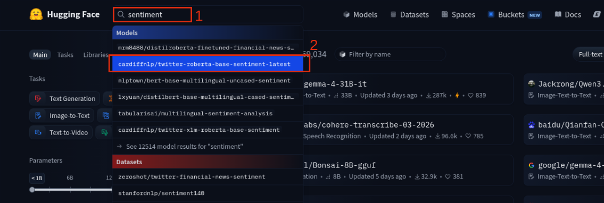
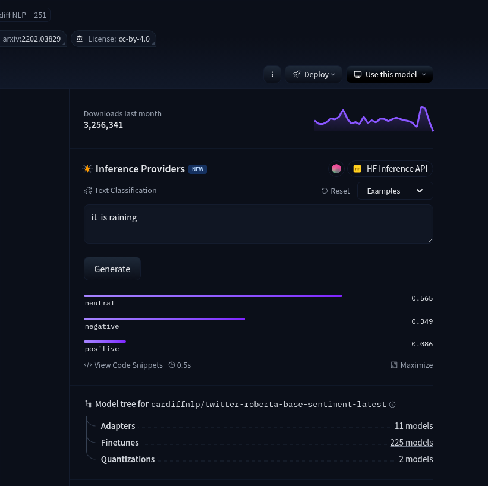

# Deploy a model using Sagemaker

## Prerequisites
- AWS account
- Amazon sagemaker domain with an active user profile (see [configuration steps](https://github.com/egafossojm/ai-engineering/blob/main/amazon-sagemaker/domain-setup.md))

## Via AWS Console
1. Open **Amazon SageMaker AI** and navigate to the domains tab. 
2. Hit `open studio` in front of your domain, and select the user profile you want to use and open SageMaker Studio.
3. Select `JupyterLab` in the **Applications** frame and run the JupyterLab space you want if any. If not space, create one with default config and launch it.
4. Check the space **Status** and **Action** columns to make sure the space is ready, Then `Open` it.
5. Once in the JupyterLab Launcher, create a Notebook (`File` > `New` > `Notebook`).
6. Navigate to [Hugging Face website](https://huggingface.co/models) to get a free model.
7. Once on the models page, use the search bar to find and select a specific model or type of models.\

8. On the choosen model page, you can test the model with the **Inference Providers** pn the right hand side.\

9. On the top right of the model page, click `Deploy` button and select `Amazon SageMaker`.
10. copy the **deploy.py** file and paste it in JupyterLab Notebook. 
11. In the notbook, Insert a cell at the first rank and type  ```pip install 'sagemaker<3.0.0```
12. Run All cells in the NoteBook

