# BERT Model vs DistilBERT Model

### 1. Architecture
- The Bert-based model has 12 transformer layers (Also called encoder layers), 12 attention heads and a hidden size of 766(embedding dimensions). This results in the model of approximately 110 million parameters.
- The DistilBert-based model has 6 transformer layers, 12 attention heads and a hidden size of 768. This results in the model with approximately 66 million parameters. Whcih is roughly 40% smaller than BERT-Based model

### 2. Efficiency (Speed, memory, performance...)
- The BERT-base require more computational resources and time for both training and inference, due to its large size.
- The DistilBERT-based model is 60% faster than BERT-based during inference because of its reduced size and fewer transformer layers.
- The BERT-based also consumes more RAM memory during training due to the lager number of parameters.
- DistilBERT requires significantly less memory, making it more suitable for deployment on devices with limited resources(ex: mobile devices).

### 3. Summary
- The DistilBERT-based model is 40% smaller and retains 90% of BERTs performance.
- So, There is a tiny trade-off when it comes to accuracy, but a huge gain when it comes to deployment because it's smaller and faster.
- Therfore, for 95% of the NLP(Natural Language Processing) tasks that you are going to be doing, The DistilBERT-based is going to be enough.
- Advice: Use BERT-Base for specialized, data-heavy tasks where precision is more critical than speed—especially when the model needs to capture intricate relationships within the text.

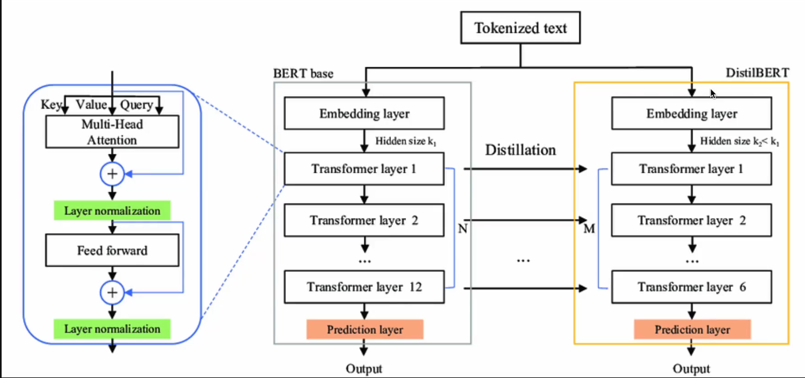

# Embeddings

### 1. Definition
Embedding is a way to represent tokens as vectors of a continuous vector space or numerical space. This allows words with similar meanings to have similar representation. That will make it easy for model to understand the relationship between these two meanings.(Translates words into a language that computers can understand and process).

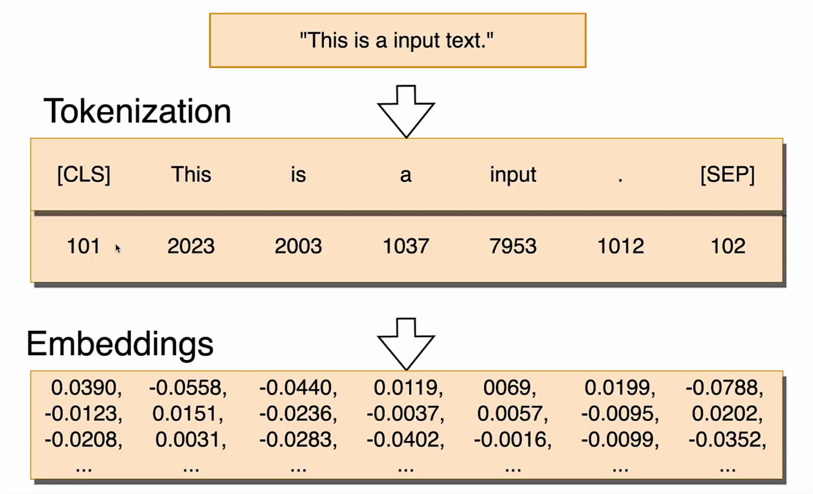

### 2. Very simple embeddings representation
This is a 3 dimension(3D) representation that is very very simple, just to understand.\
Real life Distilled BERT models are 768 dimensions(768D).

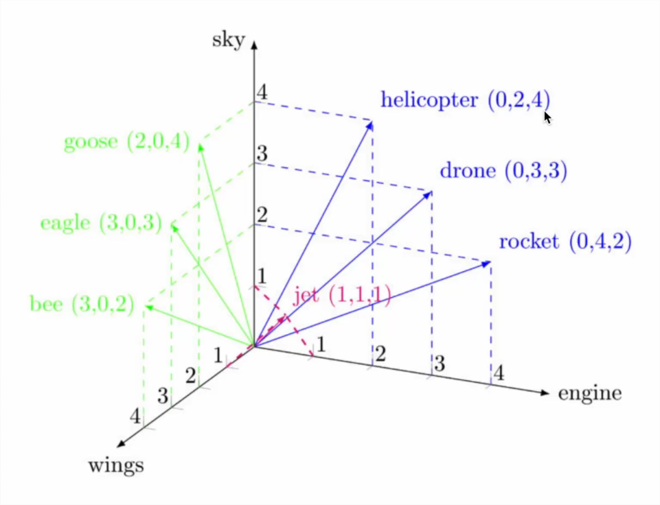

In BERT & DistilBERT architectures, the embedding layer is the very first layer of the model.

# Positional Encodings 

### Why ?
Unlike RNN-based Encoder(type of Neural Network architecture used in NLP before the "Transformer" era which gave us BERT) which looks at sentence sequencially After embeddings, Transformer's Encoder looks at the entire sequence at once and can't know tokens order.

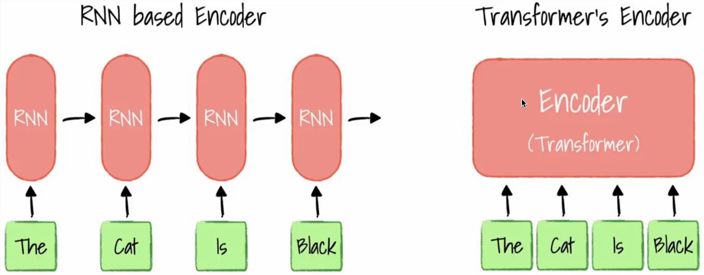

In order for the model to understand the correct position of the words, we need to add the so-called **Positional Encodings** so that the model will know the words order.

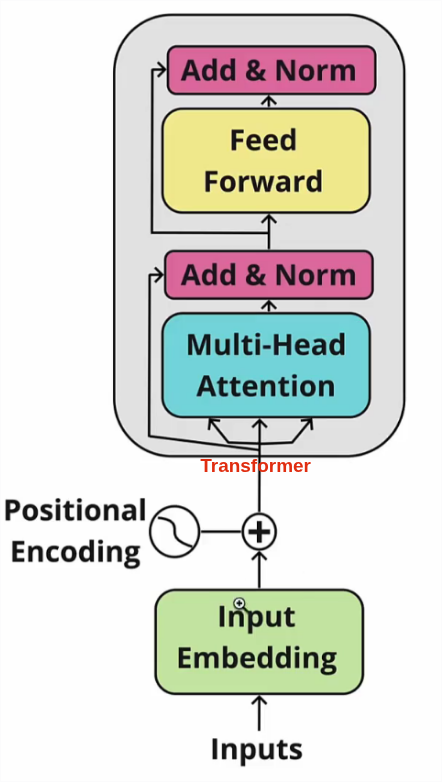

### How ?

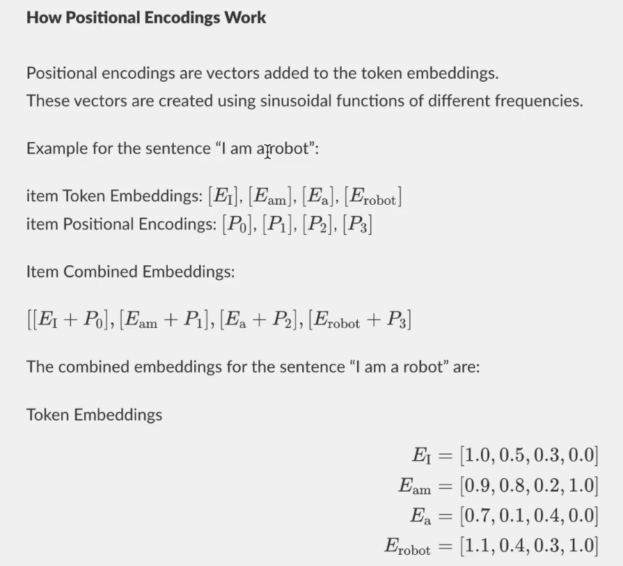

### Positional encoding calculation

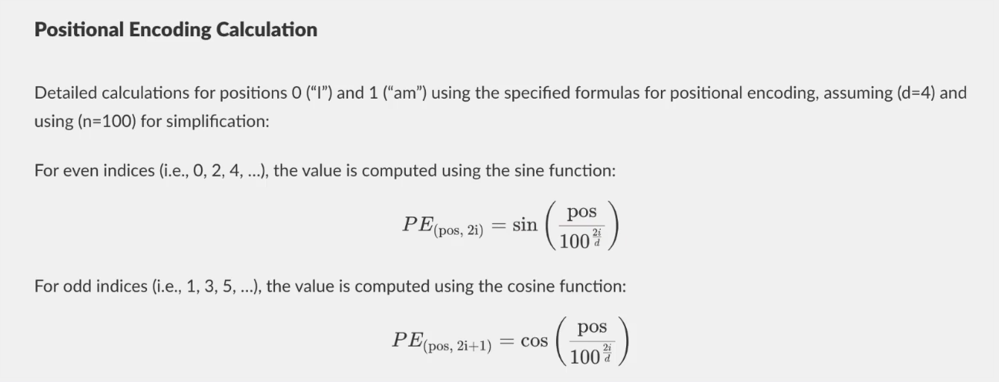
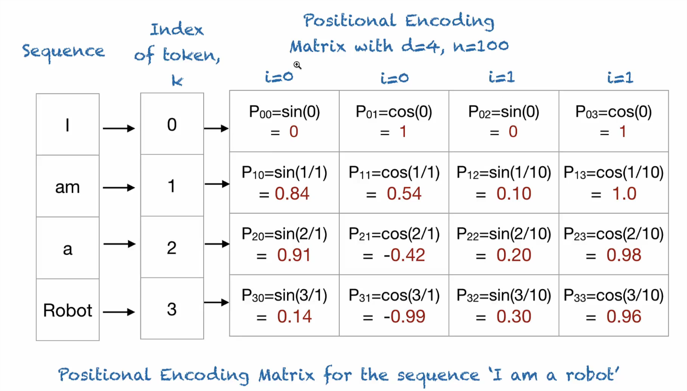

# Attention Mechanism

### 1. Self attention
**Self attention** allows the model to understand the meaning of one word in a sentence.\
In the sentence : `[CLS] The bank of the river was flooded [SEP]` The word `bank` does not mean a financial institution.\
Self attention compare/Calculate(With math) de relation between the word bank and other words in the sentence to get its real meaning in that sentence. 

### 2. How does Self Attention works ?
#### Step 1

Each embedded vector(Each embedded word token) will be multiplied by:\
`Query` Matrix to get a **Query vector**\
`Key` Matrix to get a **Key vector**\
`Value` Matrix to get a **Value vector**

These Matrices are consistent across all inputs.\
**They have weights and parameters inside of them that they have learned during training through back propagation.**

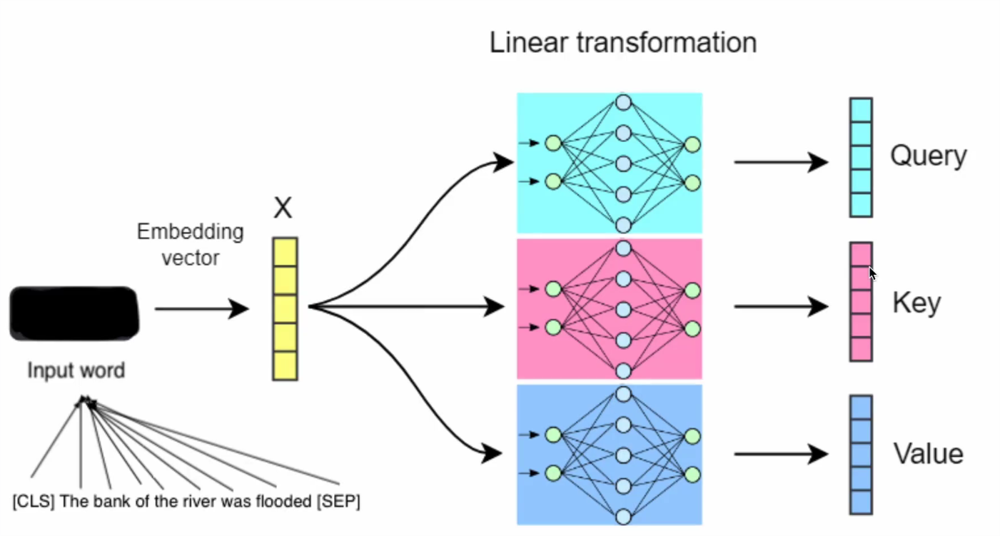

So, after the linear transformation, we are going to have :\
As many Query vectors as we have words in the input sentence.\
As many Key vectors as we have words in the input sentence.\
As many Value vectors as we have words in the input sentence.

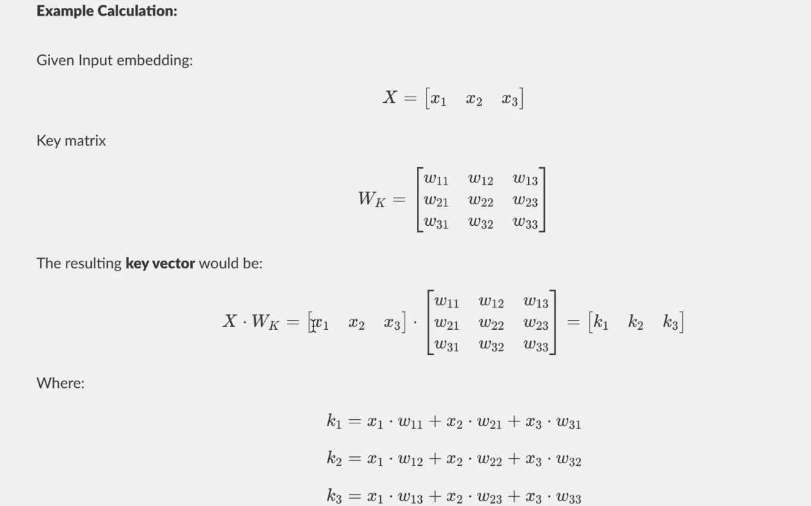

#### Step 2
Now we are going to determine for each word in the sentence, if there are another words in the sentence more relevent to it.

**How ?**: By multtiplying the Query vector of the giving word with the Key vector of other words in the sentence.\
`Attention Score` = `Query vector` **"MATHMUL"** `Key vectors`

**EX:** for the word bank, let's check the attention with river.\
`Attention Score` = `Query vector(bank)` **"MATHMUL"** `Key vector(river)`

- For bank word, we will do this for every `key vector(x)`
- We expect `Attention Score`in this case to be high to tell the model to get more attention on the word river when processing the word bank.
- This operation will be done with all other word in the sentence
- For the word bank, river and flooded are supposed to provide high attention scores. That way the model will better know the context or the meaning of the word bank.

#### Step 3

Now we will convert Attention scores into propability distributions.\
That will help the model speed up training.

**How ?**: By converting Scores to weights using Softmax.

 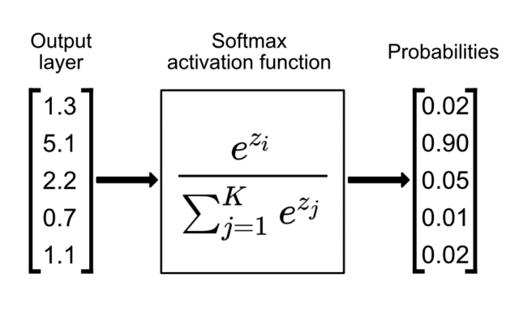

#### Step 4
Now we have the softmax Weights, (The model knows that high probabilities implies more attention), It's time for the model to get the real meaning of the word.

**How**:.By multiplying the softmax weights with the Value vector of the word.\
The `Value vectors` contain the detailed information of each token. Shows the meaning of the word. With the attention, the model will know the context and therefore the meaning in that context.\
`Final context` =`Attention Scores` **"MATHMUL"** `Value vector`

**EX:** for the word bank, let's check the result.\
`Final context(bank)` = `Attention Score` **"MATHMUL"** `Value vector(bank)`

This will provide weighted vectors.\
To get the final representation of the word bank, we are going to make a `sum` of all the weighted vectors.

 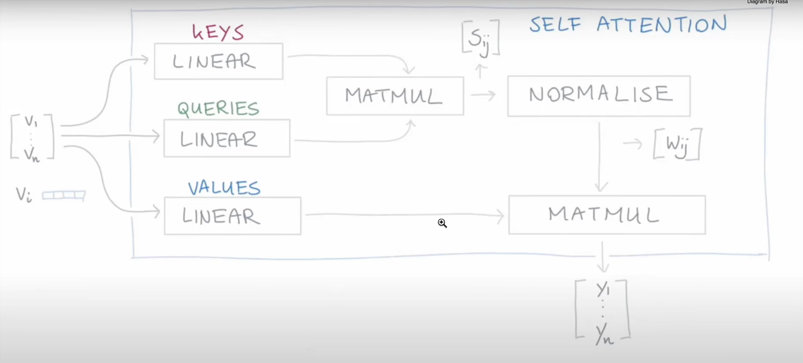

 This diagram shows the output on a single word(bank).\
 This will be done for all words in the sentence.

 ### 3. Multi Head Attention

 #### How it works ?

 In real world, there is not just 1 attention head as we saw in the previous section.
 - There are `12 attention heads in each transformer layer`. Meaning there are `72 attention heads in total` for DistilBERT.
 - Each attention head is focusing on something different in the sentence. 
 - Each attention head computes a seperate attention mechanism independently but using the same input token.(So in one transformer layer, there are 12 different query matrix, 12 different key matrix and 12 different value matrix that learn different weights)
 - All 12 attention heads within a layer process the input data at the same time, independently from each other.

  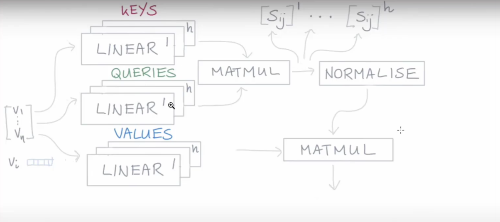

  #### Output of Attention Heads

  - Each attention head generates a contex-aware vector for each token in the input sequence.\
  - In our previous example, were are going to get `12 context-aware vectors`(12 different vectors) for the word bank in `each transformer layer`. Same for all other words in the sentence.
  - `FINALLY: we are going to concatenate all the 12 resulting vectors to make one very long vector.`

  #### After concatenation

  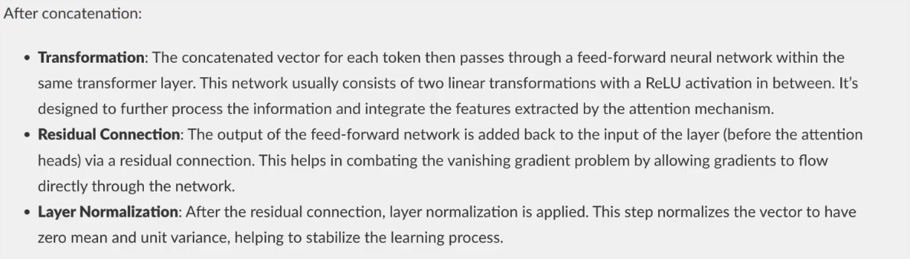
  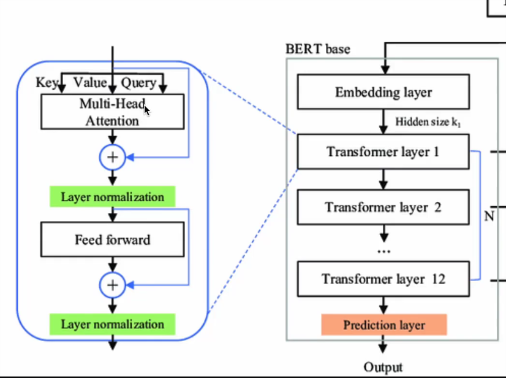

  After all this, we then get the output for the next transformer.

#### Example of Focus areas for groups of attention Heads

  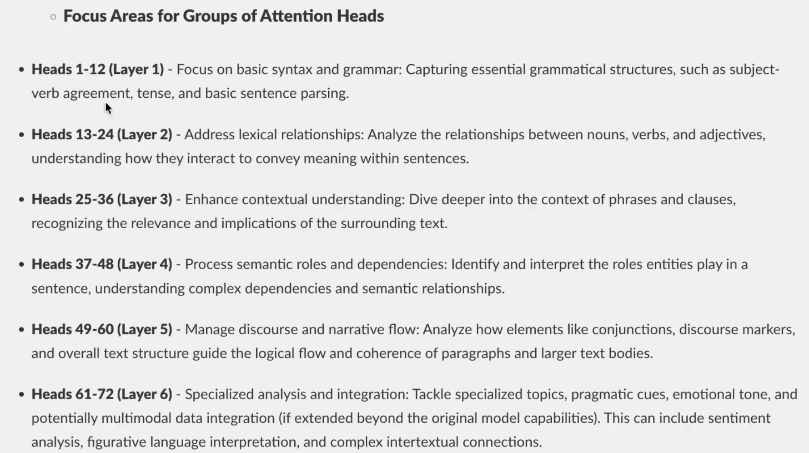